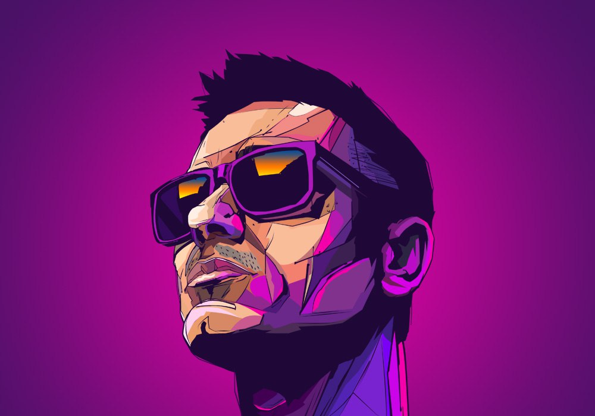

## Hi, I'm Vlad Radkevich
#### Fronend-developer from Belarus
  
#### I'm a student of Vitebsk State University
---
#### Additional information: 
```
English level: A2+
HTML, CSS, SCSS, JS, C++, Java
```
---
#### Contacts:
[](https://t.me/vladradkevich) [](https://discordapp.com/users/243710993790795776/) [](https://www.instagram.com/_vladradkevich_/) [](mailto:=vlad.radkevich28@gmail.com) 
### Code examples
```
const merge2Arrays = (firstArray, secondArray) => {
    const sortArray = [];
    let i =0, j = 0;

    while (i < firstArray.length && j < secondArray.length) {
        if (firstArray[i] < secondArray[j]) {
            sortArray.push(firstArray[i]);
            i++;
        } else {
            sortArray.push(secondArray[j]);
            j++;
        }
    }   
    return [...sortArray, ...firstArray.slice(i), ...secondArray.slice(j)];
};
```
---
### Courses:
* HTML & CSS (result school)
* JS (Udemy, in progress)
* YT course (Vladilen Minin, Glo academy and more)
* CS50 course

